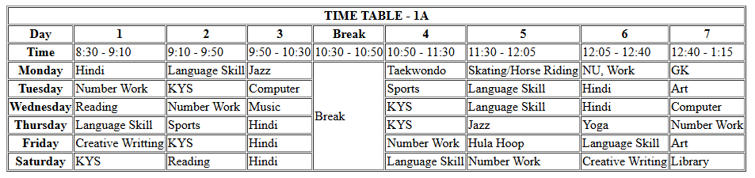

# 🏫 School Time Table (Pure HTML)

A structured and responsive **School Time Table** created using **HTML tables**.  
This project helped me dive deep into table layouts, understand modern HTML5 attributes, and explore deprecated tags that are no longer in use.


---

## 📚 What This Project Covers

- ✅ Creating structured layouts with `<table>`, `<thead>`, `<tbody>`, `<tfoot>`
- ✅ Use of HTML5-supported attributes (like `scope`, `colspan`, `rowspan`)
- ❌ Awareness of deprecated attributes like `cellpadding`, `cellspacing`, and why they shouldn't be used
- 📐 Clean formatting and semantic organization
- 🌐 100% pure HTML, no CSS or JavaScript involved

---

## 🛠 Tech Stack

| Technology | Description               |
|------------|---------------------------|
| HTML5      | Table layout and semantics|

---

## 📸 Preview

> A quick peek into the layout of the timetable:

 <!-- Optional: Use a GIF or screenshot -->

---

## ✨ Features

- Neat and readable weekly school schedule
- Pure HTML with semantic elements
- Clear distinction between headers and data rows
- Great for learning or adapting into more complex dashboard systems

---

## 📁 File Structure

```bash
school-timetable-html/
│
├── index.html         # Main timetable page
└── README.md          # Project documentation
